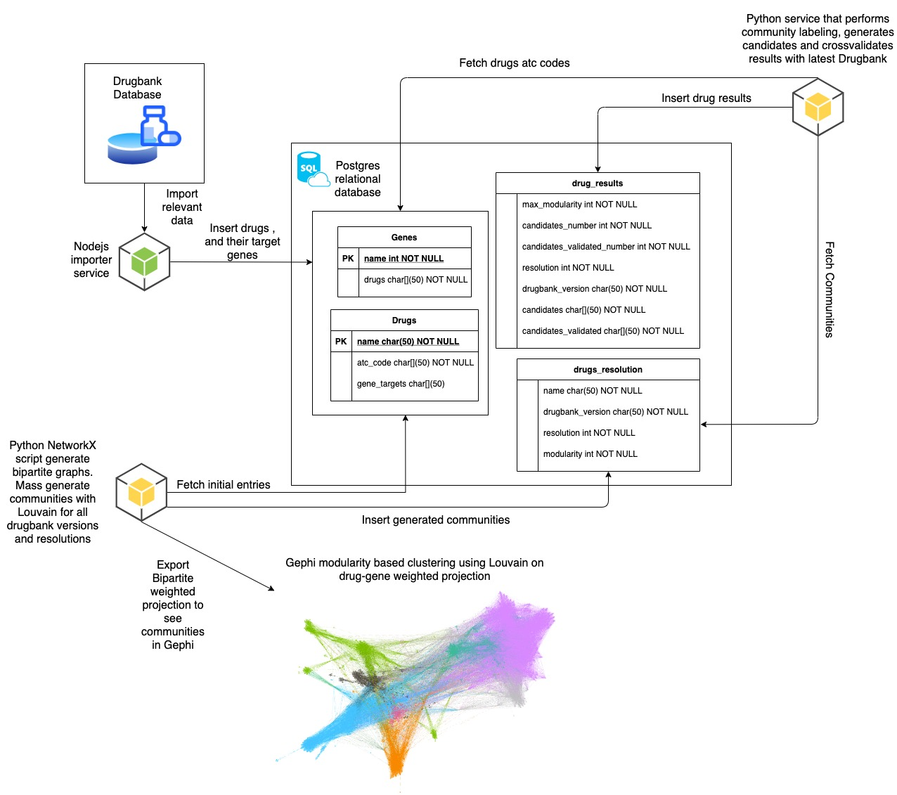
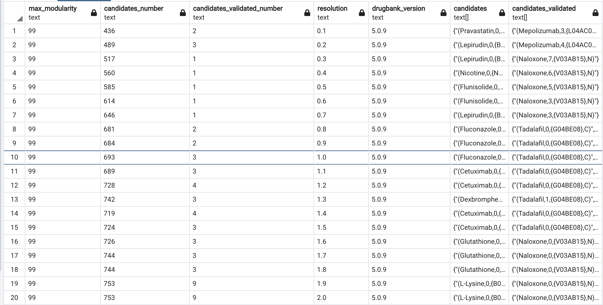

# Drug-gene network project

## Top down view of the project structure

The project is split into the following 3 subdirectories

1. The _**nodejs_importer_service**_ folder contains the required nodejs script and docker-compose file for spinning up the project database.  
You will need the following tools for installing and working with the drugbank db:  
- Docker and Docker-compose 
- Nodejs
- PGAdmin(recommended) for visualising the database.
- downloaded drugbank xmls from the [_Drugbank_](www.drugbank.com) repository.  
Relevant command for the subdirectory folder
Enter the subdirectory in your prefered terminal window and type:  
    * **docker-compose up && npm i**: This will spin up a docker container responsible for storing the database.
    * open PGAdmin and create the tables from the _**migration.sql**_ file.
    * **node index.js _filepath_ _database_version_**: This command will start inserting into the database one drugbank version. For the _**filepath**_ please insert the relative path where your drugbank xmls are located for example '../../Desktop/drugbanks/5.0.10/drugbank.xml', and for _**database_version**_ use the version for your xml (for example '5.0.10').

2. The _**community_and_candidates_generators**_ folder contains the python scripts that generate the drug communities with Louvain and based on those communities we select candidates and crossvalidate them with the latest **drugbank version**. 
You will need these python packages in the python scripts:
- psycopg2
- pandas
- networkx
- cdlib  
There are two python scripts that need to run to obtain the right results: 
    * _community_generator_.py is used to generate the communities with multiple resolution values using the louvain method for a number of drugbank versions. Please write into the array only the ones that you have in your database (ex.: [5.0.9,5.0.10 ...]) 
    * candidates_generator.py is used to insert the candidates identified for every community generated previously. And for older versions than 5.1.8 the crossvalidated results. Again use the array only with values that you generated communities for.    

    After running the scripts corectly you should have something similar to this in the drug_results table  

    

3. The helpers folder contains scripts that generate community distribution charts and gexf files to visualize in Gephy.
